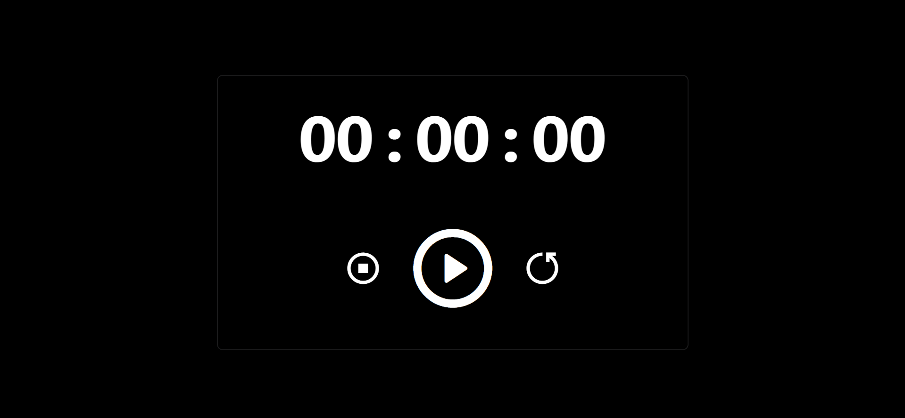

# Awesome JavaScript Projects

[](https://github.com/adityadhiman-in/javascript_projects_library/blob/main/LICENSE)
[](https://github.com/adityadhiman-in/javascript_projects_library/issues)
[](https://github.com/adityadhiman-in/javascript_projects_library/stargazers)
[](https://github.com/adityadhiman-in/javascript_projects_library/network)

A simple and user-friendly Notes App built using HTML, CSS, and JavaScript. This app allows users to create, edit, and delete notes effortlessly.


Welcome to my collection of awesome JavaScript projects! Here you'll find a variety of projects showcasing different aspects of web development using JavaScript. Feel free to explore the projects and check out the code.

## Projects

### 1. [Weather App](https://adityadhiman-in.github.io/live_weather_app/)


A beautiful weather app built with HTML, CSS, and JavaScript. It utilizes the OpenWeatherMap API to fetch and display weather data.

- **GitHub Repository**: [live_weather_app](https://github.com/adityadhiman-in/live_weather_app)

### 2. [To Do List App](https://adityadhiman-in.github.io/toDoApp/)


An interactive to-do list app created with HTML, CSS, and JavaScript. It features local storage to save tasks and manage your to-do list efficiently.

- **GitHub Repository**: [toDoApp](https://github.com/adityadhiman-in/toDoApp)

### 3. [Quiz App](https://adityadhiman-in.github.io/Quiz_App/)


A quiz application built using HTML, CSS, and JavaScript. It displays questions, options, and shows the result after completion.

- **GitHub Repository**: [Quiz_App](https://github.com/adityadhiman-in/Quiz_App)

### 4. [Secure Password Generator](https://adityadhiman-in.github.io/Quiz_App/)


A secure password generator using HTML, CSS, and JavaScript. It
generates a secure password of length 16 words.

- **GitHub Repository**: [password_generator](https://github.com/adityadhiman-in/password_generator)

### 5. [Notes App](https://adityadhiman-in.github.io/notes_app_javascript/)


A simple and user-friendly Notes App built using HTML, CSS, and JavaScript. This app allows users to create, edit, and delete notes effortlessly.

- **GitHub Repository**: [notes_app_javascript](https://github.com/adityadhiman-in/notes_app_javascript)

### 6. [Qr Code Generator](https://adityadhiman-in.github.io/qr_code_generator/)


A simple and user-friendly Notes App built using HTML, CSS, and JavaScript. This app allows users to create, edit, and delete notes effortlessly.

- **GitHub Repository**: [qr_code_generator](https://github.com/adityadhiman-in/qr_code_generator)

### 7. [Age Calculator](https://adityadhiman-in.github.io/age_calculator)


This is a Beautiful web-based Age Calculator that determines your age in years, months, and days based on your birth date.

- **GitHub Repository**: [age_calculator](https://github.com/adityadhiman-in/age_calculator)

### 8. [Calculator](https://adityadhiman-in.github.io/calculator/)


A simple and elegant calculator built with HTML, CSS, and JavaScript. This calculator can perform basic arithmetic operations and includes features for clearing input and deleting the last character.

- **GitHub Repository**: [calculator](https://github.com/adityadhiman-in/calculator)

### 9. [Quotes Generator](https://adityadhiman-in.github.io/quotes_generator/)


This is a beautiful web-based Quote Generator that fetches and displays random quotes from an API. Users can also share the quotes via WhatsApp.

- **GitHub Repository**: [quote generator](https://github.com/adityadhiman-in/quotes_generator)

### 10. [Stopwatch](https://adityadhiman-in.github.io/stopwatch/)



This project is a beautiful stopwatch built using HTML, CSS, and
JavaScript. It allows users to start, stop, and reset a timer with
a user-friendly interface.

- **GitHub Repository**: [stopwatch](https://github.com/adityadhiman-in/stopwatch)

### 11. [Music Player](https://adityadhiman-in.github.io/music_player/)


A contemporary and feature-rich music player crafted using HTML,
CSS, and JavaScript. This project showcases functionalities such as play, pause, next, and previous controls, alongside a progress
bar for seamless song management.

- **GitHub Repository**: [music player](https://github.com/adityadhiman-in/music_player)

### 11. [Digital Watch](https://adityadhiman-in.github.io/digital_watch/)


A contemporary and feature-rich music player crafted using HTML, CSS, and JavaScript. This project showcases functionalities such
as play, pause, next, and previous controls, alongside a progressbar for seamless song management.

- **GitHub Repository**: [digital watch](https://github.com/adityadhiman-in/digital_watch)

## How to Run

1. Clone the repository:

   ```bash
   git clone https://github.com/adityadhiman-in/javascript_projects_library.git
   ```

2. Navigate into the project directory:

   ```bash
   cd your-repository-name
   ```

3. Open the `index.html` file in your browser to see the project in action.

## Contact

Feel free to reach out if you have any questions or suggestions!

- [Website](https://adityadhiman.in)
- [GitHub](https://github.com/adityadhiman-in)
- [LinkedIn](https://www.linkedin.com/in/adityadhiman-in)

Made with ❤️ by [Aditya Dhiman](https://adityadhiman.in)
