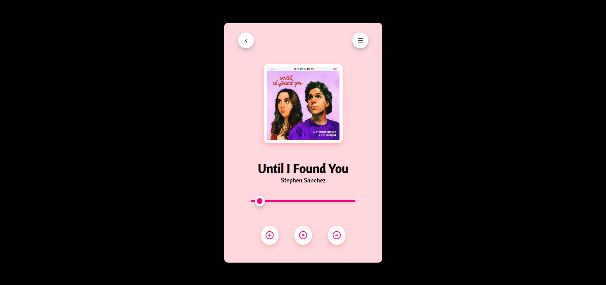

# Music Player



A contemporary and feature-rich music player crafted using HTML, CSS, and JavaScript. This project showcases functionalities such as play, pause, next, and previous controls, alongside a progress bar for seamless song management.

## Features

- **Play/Pause Control**: Toggle between playing and pausing the track.
- **Next/Previous Track**: Navigate through the playlist with ease.
- **Progress Bar**: Monitor and adjust playback position.
- **Customizable Playlist**: Easily modify the list of songs.

## Getting Started

### Prerequisites

- A modern web browser (e.g., Chrome, Firefox, Edge)
- Fundamental knowledge of HTML, CSS, and JavaScript

### Installation

1. **Clone the repository**:
   ```bash
   git clone https://github.com/adityadhiman-in/music_player.git
   ```
2. **Navigate to the project directory**:
   ```bash
   cd music-player
   ```
3. **Open `index.html` in your browser**.

### Usage

1. **Add Songs**: Modify the `songs` array in `script.js` to include your music files and metadata.
2. **Customize Appearance**: Edit `style.css` to tailor the look and feel of the player.
3. **Interact with the Player**:
   - **Play/Pause**: Click the play/pause icon to control playback.
   - **Next/Previous**: Use the next or previous buttons to switch between tracks.
   - **Progress Bar**: Adjust the playback position using the progress bar.

## File Structure

- **`index.html`**: The primary HTML file for the music player interface.
- **`style.css`**: CSS file responsible for styling the player.
- **`script.js`**: JavaScript file containing the logic for player controls.
- **Music files**: Place your audio files in the project directory.

## Contributing

Contributions are welcome! Please submit issues, propose enhancements, or contribute code via pull requests.

## License

This project is licensed under the MIT License. See the [LICENSE](LICENSE) file for more details.

## Contact

Feel free to reach out if you have any questions or suggestions!

- [Website](https://adityadhiman.in)
- [GitHub](https://github.com/adityadhiman-in)
- [LinkedIn](https://www.linkedin.com/in/adityadhiman-in)

Made with ❤️ by [Aditya Dhiman](https://adityadhiman.in)
