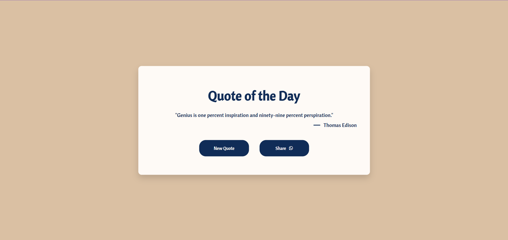

# Quote Generator

[](https://github.com/adityadhiman-in/notes_app_javascript/blob/main/LICENSE)
[](https://github.com/adityadhiman-in/notes_app_javascript/issues)
[](https://github.com/adityadhiman-in/notes_app_javascript/stargazers)
[](https://github.com/adityadhiman-in/notes_app_javascript/network)



This is a beautiful web-based Quote Generator that fetches and displays random quotes from an API. Users can also share the quotes via WhatsApp.

## Features

- Fetches random quotes from the Type.fit API.
- Displays the quote and the author's name.
- Allows users to generate a new random quote.
- Provides an option to share the quote via WhatsApp.

## Technologies Used

- HTML
- CSS
- JavaScript

## Demo

Check out the live demo of the project [here](https://adityadhiman-in.github.io/quotes_generator/).

## Getting Started

To get a local copy up and running, follow these simple steps:

### Prerequisites

You need a modern web browser to run the application.

### Installation

1. **Clone the repository:**

   ```bash
   git clone https://github.com/adityadhiman-in/quotes_generator.git
   ```

2. Navigate into the project directory:

   ```bash
   cd your-repository-name
   ```

3. Open the `index.html` file in your browser to see the project in action.

## Contact

Feel free to reach out if you have any questions or suggestions!

- [Website](https://adityadhiman.in)
- [GitHub](https://github.com/adityadhiman-in)
- [LinkedIn](https://www.linkedin.com/in/adityadhiman-in)

Made with ❤️ by [Aditya Dhiman](https://adityadhiman.in)
